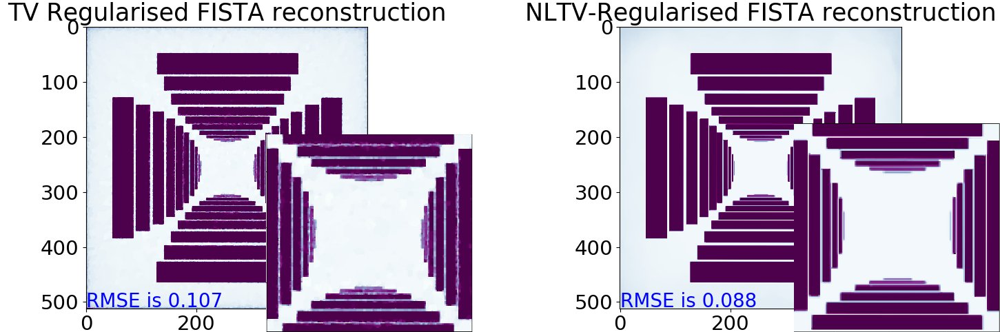

# CCPi-Regularisation Toolkit (CCPi-RGL)


| Master | Development | Anaconda binaries |
|--------|-------------|-------------------|
| [](https://anvil.softeng-support.ac.uk/jenkins/job/CILsingle/job/CCPi-Regularisation-Toolkit/) | [](https://anvil.softeng-support.ac.uk/jenkins/job/CILsingle/job/CCPi-Regularisation-Toolkit-dev/) |   [ ](https://anaconda.org/ccpi/ccpi-regulariser) |

**Iterative image reconstruction (IIR) methods normally require regularisation to stabilise the convergence and make the reconstruction problem (inverse problem) more well-posed. The CCPi-RGL software provides 2D/3D and multi-channel regularisation strategies to ensure better performance of IIR methods. The regularisation modules are well-suited to use with [splitting algorithms](https://en.wikipedia.org/wiki/Augmented_Lagrangian_method#Alternating_direction_method_of_multipliers), such as, [ADMM](https://github.com/dkazanc/ADMM-tomo) and [FISTA](https://github.com/dkazanc/FISTA-tomo). Furthermore, the toolkit can be used for simpler inversion tasks, such as, image denoising, inpaiting, deconvolution etc. The core modules are written in C-OMP and CUDA languages and wrappers for Matlab and Python are provided.** 

<div align="center">
  <br>  
</div>

<div align="center">
  <br>  
</div>

<div align="center">
  <br>  
</div>

## Prerequisites: 

 * [MATLAB](www.mathworks.com/products/matlab/) OR
 * Python (tested ver. 3.5/2.7); Cython
 * C compilers
 * nvcc (CUDA SDK) compilers

## Package modules:

### Single-channel (denoising):
1. Rudin-Osher-Fatemi (ROF) Total Variation (explicit PDE minimisation scheme) **2D/3D CPU/GPU** (Ref. *1*)
2. Fast-Gradient-Projection (FGP) Total Variation **2D/3D CPU/GPU** (Ref. *2*)
3. Split-Bregman (SB) Total Variation **2D/3D CPU/GPU** (Ref. *5*)
4. Total Generalised Variation (TGV) model for higher-order regularisation **2D/3D CPU/GPU** (Ref. *6*)
5. Linear and nonlinear diffusion (explicit PDE minimisation scheme) **2D/3D CPU/GPU** (Ref. *8*)
6. Anisotropic Fourth-Order Diffusion (explicit PDE minimisation) **2D/3D CPU/GPU** (Ref. *9*)
7. A joint ROF-LLT (Lysaker-Lundervold-Tai) model for higher-order regularisation **2D/3D CPU/GPU** (Ref. *10,11*)
8. Nonlocal Total Variation regularisation (GS fixed point iteration) **2D CPU/GPU** (Ref. *12*)

### Multi-channel (denoising):
1. Fast-Gradient-Projection (FGP) Directional Total Variation **2D/3D CPU/GPU** (Ref. *3,4,2*)
2. Total Nuclear Variation (TNV) penalty **2D+channels CPU** (Ref. *7*)

### Inpainting:
1. Linear and nonlinear diffusion (explicit PDE minimisation scheme) **2D/3D CPU** (Ref. *8*)
2. Iterative nonlocal vertical marching method  **2D CPU**


## Installation:

The package comes as a [CMake](https://cmake.org) project so you will need CMake (v.>=3) to configure it. Additionally you will need a C compiler, `make` (on linux) and CUDA SDK where available. The toolkit may be used directly from C/C++ as it is compiled as a shared library (check-out the include files in `Core` for this). We provide wrappers for Python and Matlab.

1. Clone this repository to a directory, i.e. `CCPi-Regularisation-Toolkit`, 
2. create a build directory. 
3. Issue `cmake` to configure (or `cmake-gui`, or `ccmake`, or `cmake3`). Use additional flags to fine tune the configuration. 

### CMake flags
Flags used during configuration

| CMake flag | type | meaning |
|:---|:----|:----|
| `BUILD_PYTHON_WRAPPER` | bool | `ON\|OFF` whether to build the Python wrapper |
| `BUILD_MATLAB_WRAPPER` | bool | `ON\|OFF` whether to build the Matlab wrapper |
| `CMAKE_INSTALL_PREFIX` | path | your favourite install directory |
| `PYTHON_DEST_DIR` | path | python modules install directory (default `${CMAKE_INSTALL_PREFIX}/python`) |
| `MATLAB_DEST_DIR` | path | Matlab modules install directory (default `${CMAKE_INSTALL_PREFIX}/matlab`)|
| `BUILD_CUDA` | bool | `ON\|OFF` whether to build the CUDA regularisers |
| `CONDA_BUILD`| bool | `ON\|OFF` whether it is installed with `setup.py install`|
| `Matlab_ROOT_DIR` | path | Matlab directory|
|`PYTHON_EXECUTABLE` | path | /path/to/python/executable|

Here an example of build on Linux (see also `run.sh` for additional info):

```bash
git clone https://github.com/vais-ral/CCPi-Regularisation-Toolkit.git
cd build
cmake .. -DCONDA_BUILD=OFF -DBUILD_MATLAB_WRAPPER=ON -DBUILD_PYTHON_WRAPPER=ON -DBUILD_CUDA=ON -DCMAKE_BUILD_TYPE=Release -DCMAKE_INSTALL_PREFIX=./install
make install
cd install/python
export LD_LIBRARY_PATH=${LD_LIBRARY_PATH}:../lib
```


### Python
#### Python binaries
Python binaries are distributed via the [ccpi](https://anaconda.org/ccpi/ccpi-regulariser) conda channel. Currently we produce packages for Linux64, Python 2.7, 3.5 and 3.6, NumPy 1.12 and 1.13.

```
conda install ccpi-regulariser -c ccpi -c conda-forge
```

#### Python (conda-build)
```
	export CIL_VERSION=0.10.4
	conda build Wrappers/Python/conda-recipe --numpy 1.12 --python 3.5 
	conda install ccpi-regulariser=${CIL_VERSION} --use-local --force
	cd demos/
	python demo_cpu_regularisers.py # to run CPU demo
	python demo_gpu_regularisers.py # to run GPU demo
```

#### Python build

If passed `CONDA_BUILD=ON` the software will be installed by issuing `python setup.py install` which will install in the system python (or whichever other python it's been picked up by CMake at configuration time.) 
If passed `CONDA_BUILD=OFF` the software will be installed in the directory pointed by `${PYTHON_DEST_DIR}` which defaults to `${CMAKE_INSTALL_PREFIX}/python`. Therefore this directory should be added to the `PYTHONPATH`.

If Python is not picked by CMake you can provide the additional flag to CMake `-DPYTHON_EXECUTABLE=/path/to/python/executable`.

### Matlab

Matlab wrapper will install in the `${MATLAB_DEST_DIR}` directory, which defaults to `${CMAKE_INSTALL_PREFIX}/matlab`

If Matlab is not picked by CMake, you could add `-DMatlab_ROOT_DIR=<Matlab directory>`. 

#### Linux
Because you've installed the modules in `<your favourite install directory>` you need to instruct Matlab to look in those directories:

```bash 

PATH="/path/to/mex/:$PATH" LD_LIBRARY_PATH="/path/to/library:$LD_LIBRARY_PATH" matlab
```
By default `/path/to/mex` is `${CMAKE_INSTALL_PREFIX}/bin` and `/path/to/library/` is `${CMAKE_INSTALL_PREFIX}/lib`

#### Windows
On Windows the `dll` and the mex modules must reside in the same directory. It is sufficient to add the directory at the beginning of the m-file.
```matlab
addpath(/path/to/library);
```

#### Legacy Matlab installation (partly supported, please use Cmake)
```
	
	cd /Wrappers/Matlab/mex_compile
	compileCPU_mex.m % to compile CPU modules
	compileGPU_mex.m % to compile GPU modules (see instructions in the file)
```

### References to implemented methods:
1. [Rudin, L.I., Osher, S. and Fatemi, E., 1992. Nonlinear total variation based noise removal algorithms. Physica D: nonlinear phenomena, 60(1-4), pp.259-268.](https://www.sciencedirect.com/science/article/pii/016727899290242F)

2. [Beck, A. and Teboulle, M., 2009. Fast gradient-based algorithms for constrained total variation image denoising and deblurring problems. IEEE Transactions on Image Processing, 18(11), pp.2419-2434.](https://doi.org/10.1109/TIP.2009.2028250)

3. [Ehrhardt, M.J. and Betcke, M.M., 2016. Multicontrast MRI reconstruction with structure-guided total variation. SIAM Journal on Imaging Sciences, 9(3), pp.1084-1106.](https://doi.org/10.1137/15M1047325)

4. [Kazantsev, D., Jørgensen, J.S., Andersen, M., Lionheart, W.R., Lee, P.D. and Withers, P.J., 2018. Joint image reconstruction method with correlative multi-channel prior for X-ray spectral computed tomography. Inverse Problems, 34(6)](https://doi.org/10.1088/1361-6420/aaba86) **Results can be reproduced using the following** [SOFTWARE](https://github.com/dkazanc/multi-channel-X-ray-CT)

5. [Goldstein, T. and Osher, S., 2009. The split Bregman method for L1-regularized problems. SIAM journal on imaging sciences, 2(2), pp.323-343.](https://doi.org/10.1137/080725891)

6. [Bredies, K., Kunisch, K. and Pock, T., 2010. Total generalized variation. SIAM Journal on Imaging Sciences, 3(3), pp.492-526.](https://doi.org/10.1137/090769521)

7. [Duran, J., Moeller, M., Sbert, C. and Cremers, D., 2016. Collaborative total variation: a general framework for vectorial TV models. SIAM Journal on Imaging Sciences, 9(1), pp.116-151.](https://doi.org/10.1137/15M102873X)

8. [Black, M.J., Sapiro, G., Marimont, D.H. and Heeger, D., 1998. Robust anisotropic diffusion. IEEE Transactions on image processing, 7(3), pp.421-432.](https://doi.org/10.1109/83.661192)

9. [Hajiaboli, M.R., 2011. An anisotropic fourth-order diffusion filter for image noise removal. International Journal of Computer Vision, 92(2), pp.177-191.](https://doi.org/10.1007/s11263-010-0330-1)

10. [Lysaker, M., Lundervold, A. and Tai, X.C., 2003. Noise removal using fourth-order partial differential equation with applications to medical magnetic resonance images in space and time. IEEE Transactions on image processing, 12(12), pp.1579-1590.](https://doi.org/10.1109/TIP.2003.819229)

11. [Kazantsev, D., Guo, E., Phillion, A.B., Withers, P.J. and Lee, P.D., 2017. Model-based iterative reconstruction using higher-order regularization of dynamic synchrotron data. Measurement Science and Technology, 28(9), p.094004.](https://doi.org/10.1088/1361-6501/aa7fa8)

12. [Abderrahim E., Lezoray O. and Bougleux S. 2008. Nonlocal discrete regularization on weighted graphs: a framework for image and manifold processing." IEEE Trans. Image Processing 17(7), pp. 1047-1060.](https://ieeexplore.ieee.org/document/4526700)

### References to Software:
* If software is used, please refer to [11], however, the supporting publication is in progress. 

### Applications:

* [Regularised FISTA iterative reconstruction algorithm for X-ray tomographic reconstruction with highly inaccurate measurements (MATLAB/Python code)](https://github.com/dkazanc/FISTA-tomo)
* [Regularised ADMM iterative reconstruction algorithm for X-ray tomographic reconstruction (MATLAB code)](https://github.com/dkazanc/ADMM-tomo)
* [Joint image reconstruction method with correlative multi-channel prior for X-ray spectral computed tomography (MATLAB code)](https://github.com/dkazanc/multi-channel-X-ray-CT)

### License:
[Apache License, Version 2.0](http://www.apache.org/licenses/LICENSE-2.0)

### Acknowledgments:
CCPi-RGL software is a product of the [CCPi](https://www.ccpi.ac.uk/) group and STFC SCD software developers. Any relevant questions/comments can be e-mailed to Daniil Kazantsev at dkazanc@hotmail.com
