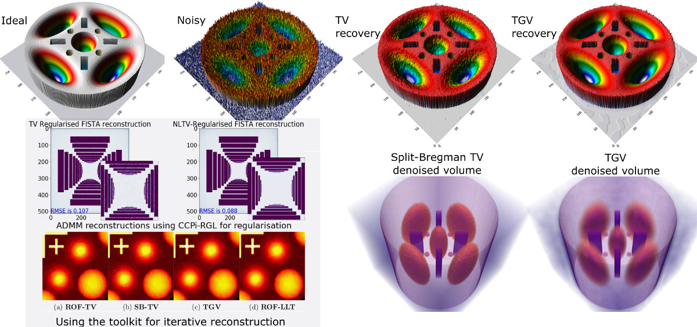

# CCPi-Regularisation Toolkit ([Software X paper](https://www.sciencedirect.com/science/article/pii/S2352711018301912))

[](https://anvil.softeng-support.ac.uk/jenkins/job/CILsingle/job/CCPi-Regularisation-Toolkit/lastBuild)
[   ](https://anaconda.org/ccpi/ccpi-regulariser)
[](https://github.com/TomographicImaging/CCPi-Regularisation-Toolkit/blob/master/LICENSE)

Iterative image reconstruction (IIR) methods frequently require regularisation to ensure convergence and make inverse problem well-posed. The CCPi-Regularisation Toolkit (CCPi-RGL) toolkit provides a set of 2D/3D regularisation strategies to guarantee a better performance of IIR methods (higher SNR and resolution). The regularisation modules for scalar and vectorial datasets are based on the [proximal operator](https://en.wikipedia.org/wiki/Proximal_operator) framework and can be used with [proximal splitting algorithms](https://en.wikipedia.org/wiki/Proximal_gradient_method), such as PDHG, Douglas-Rachford, ADMM, FISTA and [others](https://arxiv.org/abs/0912.3522). While the main target for CCPi-RGL is [tomographic image reconstruction](https://github.com/dkazanc/ToMoBAR), the toolkit can be used for image denoising problems. The core modules are written in C-OMP and CUDA languages and wrappers for Matlab and Python are provided. With [CuPy](https://docs.cupy.dev/en/stable/index.html) dependency installed for Python, one can use regularisers directly without the need for explicit compilation. We recommend this option as the simplest to start with if you've got a GPU. This software can also be used by running in parallel across multiple GPU devices on a PC or a cluster compute node.

<div align="center"></div>

## Prerequisites

- Python (3.7+) and/or [MATLAB](https://www.mathworks.com/products/matlab)
- C compilers
- `nvcc` (CUDA SDK) compilers
  - [CuPy](https://docs.cupy.dev) for the GPU-enabled methods

## Package modules

### Single-channel (scalar)

1. Rudin-Osher-Fatemi (ROF) Total Variation (explicit PDE minimisation scheme) **2D/3D CPU/GPU + CuPy**[^1]
2. Fast-Gradient-Projection (FGP) Total Variation **2D/3D CPU/GPU**[^2]
3. Split-Bregman (SB) Total Variation **2D/3D CPU/GPU**[^5]
4. Primal-Dual (PD) Total Variation **2D/3D CPU/GPU + CuPy**[^13]
5. Total Generalised Variation (TGV) model for higher-order regularisation **2D/3D CPU/GPU**[^6][^13]
6. Linear and nonlinear diffusion (explicit PDE minimisation scheme) **2D/3D CPU/GPU**[^8]
7. Anisotropic Fourth-Order Diffusion (explicit PDE minimisation) **2D/3D CPU/GPU**[^9]
8. A joint ROF-LLT (Lysaker-Lundervold-Tai) model for higher-order regularisation **2D/3D CPU/GPU**[^10][^11]
9. Nonlocal Total Variation regularisation (GS fixed point iteration) **2D CPU/GPU**[^12]

### Multi-channel (vectorial)

1. Fast-Gradient-Projection (FGP) Directional Total Variation **2D/3D CPU/GPU**[^3][^4][^2]
2. Total Nuclear Variation (TNV) penalty **2D+channels CPU**[^7]

## Installation

The package comes as a [CMake](https://cmake.org) project and additional wrappers for Python and Matlab. Please see more detailed [Installation](./Installation.md) information.

### Python binaries

To install precompiled binaries, you need `conda` and install from the `ccpi` channel using :

```sh
conda install ccpi-regulariser -c ccpi -c conda-forge
```

### Python (GPU-CuPy)

One can also use some of the GPU modules with the provided [CuPy](https://docs.cupy.dev/en/stable/index.html) interfaces. The functions in `ccpi-regularisation-cupy` package work with CuPy arrays as an input and return a CuPy array for output.

```sh
conda install -c httomo ccpi-regularisation-cupy
```

Once installed please see [Demos](./demos/demo_gpu_regularisers3D_CuPy.py). Please note that not all modules are yet supported as this is an ongoing development. One can install both CuPy-driven and the `ccpi-regulariser` package in one environment, but please be aware that the functions carry the identical names.

## References

[^1]: [Rudin, L.I., Osher, S. and Fatemi, E., 1992. Nonlinear total variation based noise removal algorithms. Physica D: nonlinear phenomena, 60(1-4)](https://www.sciencedirect.com/science/article/pii/016727899290242F)
[^2]: [Beck, A. and Teboulle, M., 2009. Fast gradient-based algorithms for constrained total variation image denoising and deblurring problems. IEEE Transactions on Image Processing, 18(11)](https://doi.org/10.1109/TIP.2009.2028250)
[^3]: [Ehrhardt, M.J. and Betcke, M.M., 2016. Multicontrast MRI reconstruction with structure-guided total variation. SIAM Journal on Imaging Sciences, 9(3)](https://doi.org/10.1137/15M1047325)
[^4]: [Kazantsev, D., Jørgensen, J.S., Andersen, M., Lionheart, W.R., Lee, P.D. and Withers, P.J., 2018. Joint image reconstruction method with correlative multi-channel prior for X-ray spectral computed tomography. Inverse Problems, 34(6)](https://doi.org/10.1088/1361-6420/aaba86) **Results can be reproduced using the following** [SOFTWARE](https://github.com/dkazanc/multi-channel-X-ray-CT)
[^5]: [Goldstein, T. and Osher, S., 2009. The split Bregman method for L1-regularized problems. SIAM journal on imaging sciences, 2(2)](https://doi.org/10.1137/080725891)
[^6]: [Bredies, K., Kunisch, K. and Pock, T., 2010. Total generalized variation. SIAM Journal on Imaging Sciences, 3(3)](https://doi.org/10.1137/090769521)
[^7]: [Duran, J., Moeller, M., Sbert, C. and Cremers, D., 2016. Collaborative total variation: a general framework for vectorial TV models. SIAM Journal on Imaging Sciences, 9(1)](https://doi.org/10.1137/15M102873X)
[^8]: [Black, M.J., Sapiro, G., Marimont, D.H. and Heeger, D., 1998. Robust anisotropic diffusion. IEEE Transactions on image processing, 7(3)](https://doi.org/10.1109/83.661192)
[^9]: [Hajiaboli, M.R., 2011. An anisotropic fourth-order diffusion filter for image noise removal. International Journal of Computer Vision, 92(2)](https://doi.org/10.1007/s11263-010-0330-1)
[^10]: [Lysaker, M., Lundervold, A. and Tai, X.C., 2003. Noise removal using fourth-order partial differential equation with applications to medical magnetic resonance images in space and time. IEEE Transactions on image processing, 12(12)](https://doi.org/10.1109/TIP.2003.819229)
[^11]: [Kazantsev, D., Guo, E., Phillion, A.B., Withers, P.J. and Lee, P.D., 2017. Model-based iterative reconstruction using higher-order regularization of dynamic synchrotron data. Measurement Science and Technology, 28(9)](https://doi.org/10.1088/1361-6501/aa7fa8)
[^12]: [Abderrahim E., Lezoray O. and Bougleux S. 2008. Nonlocal discrete regularization on weighted graphs: a framework for image and manifold processing. IEEE Trans. Image Processing 17(7), pp. 1047-1060.](https://ieeexplore.ieee.org/document/4526700)
[^13]: [Chambolle, A. and Pock, T., 2010. A first-order primal-dual algorithm for convex problems with applications to imaging. Journal of mathematical imaging and vision 40(1)](https://doi.org/10.1007/s10851-010-0251-1)

### Software (please cite if used)

- [Kazantsev, D., Pasca, E., Turner, M.J. and Withers, P.J., 2019. CCPi-Regularisation toolkit for computed tomographic image reconstruction with proximal splitting algorithms. SoftwareX, 9, pp.317-323.](https://www.sciencedirect.com/science/article/pii/S2352711018301912)

### Applications

- [The Core Imaging Library](https://github.com/TomographicImaging/CIL) by [CCPi](https://ccpi.ac.uk/cil/)
- [TOmographic MOdel-BAsed Reconstruction (ToMoBAR)](https://github.com/dkazanc/ToMoBAR)
- [Joint image reconstruction method with correlative multi-channel prior for X-ray spectral computed tomography (MATLAB code)](https://github.com/dkazanc/multi-channel-X-ray-CT)

### License

[](https://github.com/TomographicImaging/CCPi-Regularisation-Toolkit/blob/master/LICENSE)

### Acknowledgments

CCPi-RGL software is a product of the [CCPi](https://www.ccpi.ac.uk) group and STFC SCD software developers.
Any relevant questions/comments can be e-mailed to [Daniil Kazantsev](mailto:dkazanc@hotmail.com).
